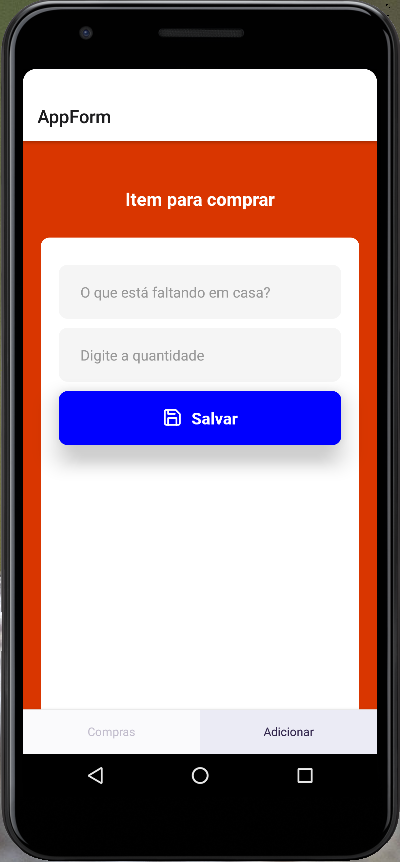

# App react-native_crud
App de lista de compras - Android e iOS (multiplataforma) usando React Native. Ele tem um CRUD completo, ou seja, tem listagem, cadastro, edição e exclusão de dados usando esta tecnologia e as suas funcionalidades de armazenamento interno, na memória do próprio dispositivo.





## Tutorial

[Luiz Tools](https://www.luiztools.com.br/post/tutorial-crud-em-app-android-e-ios-com-react-native/)

## Instalação

```bash
yarn install
```

## Execução

```bash
yarn start
```

## Execução no Android

```bash
yarn android
```

## Execução no IOS

```bash
yarn ios
```

## Execução no Web

```bash
yarn web
```

## Tecnologias

- [React Native](https://reactnative.dev/)
- [Expo](https://expo.io/)
- [React Navigation](https://reactnavigation.org/)
- [AsyncStorage](https://reactnative.dev/docs/asyncstorage)